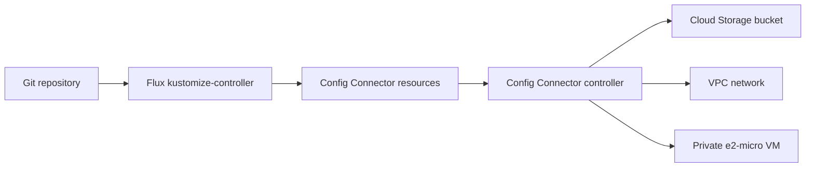

## Overview

This experiment uses Config Connector in namespaced mode. Flux applies Kubernetes
custom resources, and Config Connector reconciles them into a private Compute Engine
VM, its VPC, and a Cloud Storage bucket.



The VM has no public IP and no attached service account. The bucket blocks public
access, uses uniform bucket-level access, versioning, and a seven-day soft-delete
window.

> [!WARNING]
> The VM and disk incur charges until they are deleted. Complete the cleanup section
> when the experiment is finished.

## Repository layout

```text
config-connector/
  operator/
    configconnector.yaml
    configconnectorcontext.yaml
    kustomization.yaml
    namespace.yaml
  resources/
    bucket.yaml
    kustomization.yaml
    network.yaml
    vm.yaml
flux/
  config-connector.yaml
```

The two Flux `Kustomization` objects enforce ordering. The resource reconciliation
starts only after the namespaced Config Connector installation becomes ready.

## Prerequisites

Install and authenticate these command-line tools:

* `gcloud`
* `kubectl`
* `flux`
* `git`

You also need:

* An existing GKE cluster with Flux bootstrapped
* Permission to update the GKE cluster and enable Google Cloud APIs
* Permission to create IAM service accounts and project IAM bindings
* A Git repository already watched by the cluster's Flux `GitRepository` source

The commands below use PowerShell syntax on Windows.

## Set environment values

Open PowerShell at the repository root and set values for your environment:

```powershell
$PROJECT_ID = "your-gcp-project-id"
$CLUSTER_NAME = "your-gke-cluster-name"
$CLUSTER_LOCATION = "us-central1"
$REGION = "us-central1"
$ZONE = "us-central1-a"
$CNRM_GSA_NAME = "cnrm-controller"
$CNRM_NAMESPACE = "config-connector"
$CNRM_GSA_EMAIL = "$CNRM_GSA_NAME@$PROJECT_ID.iam.gserviceaccount.com"
```

Use the region for a regional cluster or the zone for a zonal cluster in
`$CLUSTER_LOCATION`.

Authenticate and select the project:

```powershell
gcloud auth login
gcloud config set project $PROJECT_ID
gcloud container clusters get-credentials $CLUSTER_NAME `
  --location $CLUSTER_LOCATION `
  --project $PROJECT_ID
```

## Enable APIs and GKE features

Enable the APIs used by this experiment:

```powershell
gcloud services enable `
  container.googleapis.com `
  compute.googleapis.com `
  iam.googleapis.com `
  storage.googleapis.com `
  monitoring.googleapis.com `
  --project $PROJECT_ID
```

Inspect the cluster's Workload Identity Federation configuration:

```powershell
gcloud container clusters describe $CLUSTER_NAME `
  --location $CLUSTER_LOCATION `
  --project $PROJECT_ID `
  --format="value(workloadIdentityConfig.workloadPool)"
```

The expected result is `$PROJECT_ID.svc.id.goog`. If the result is empty, enable
Workload Identity Federation for GKE:

```powershell
gcloud container clusters update $CLUSTER_NAME `
  --location $CLUSTER_LOCATION `
  --project $PROJECT_ID `
  --workload-pool="$PROJECT_ID.svc.id.goog"
```

For a Standard cluster, enable the GKE metadata server on every existing node pool:

```powershell
$NODE_POOLS = gcloud container node-pools list `
  --cluster $CLUSTER_NAME `
  --location $CLUSTER_LOCATION `
  --project $PROJECT_ID `
  --format="value(name)"

foreach ($NODE_POOL in $NODE_POOLS) {
  gcloud container node-pools update $NODE_POOL `
    --cluster $CLUSTER_NAME `
    --location $CLUSTER_LOCATION `
    --project $PROJECT_ID `
    --workload-metadata=GKE_METADATA
}
```

Skip the node-pool command for an Autopilot cluster. Enable the managed Config
Connector add-on:

```powershell
gcloud container clusters update $CLUSTER_NAME `
  --location $CLUSTER_LOCATION `
  --project $PROJECT_ID `
  --update-addons ConfigConnector=ENABLED
```

Wait for the operator and CRD:

```powershell
kubectl rollout status deployment/configconnector-operator `
  -n configconnector-operator-system `
  --timeout=10m

kubectl wait `
  --for=condition=Established `
  crd/configconnectors.core.cnrm.cloud.google.com `
  --timeout=5m
```

## Configure the controller identity

Create the Google service account if it does not already exist:

```powershell
gcloud iam service-accounts describe $CNRM_GSA_EMAIL `
  --project $PROJECT_ID

if ($LASTEXITCODE -ne 0) {
  gcloud iam service-accounts create $CNRM_GSA_NAME `
    --project $PROJECT_ID `
    --display-name="Config Connector experiment controller"
}
```

Grant roles required by the three managed resources. These are narrower than the
basic Editor or Owner roles often used in quickstarts:

```powershell
$CNRM_ROLES = @(
  "roles/compute.instanceAdmin.v1",
  "roles/compute.networkAdmin",
  "roles/storage.admin",
  "roles/monitoring.metricWriter"
)

foreach ($ROLE in $CNRM_ROLES) {
  gcloud projects add-iam-policy-binding $PROJECT_ID `
    --member="serviceAccount:$CNRM_GSA_EMAIL" `
    --role=$ROLE `
    --condition=None
}
```

Allow the namespaced Config Connector Kubernetes service account to impersonate the
Google service account:

```powershell
$CNRM_KSA = "cnrm-controller-manager-$CNRM_NAMESPACE"
$WORKLOAD_IDENTITY_MEMBER = "serviceAccount:$PROJECT_ID.svc.id.goog[cnrm-system/$CNRM_KSA]"

gcloud iam service-accounts add-iam-policy-binding $CNRM_GSA_EMAIL `
  --project $PROJECT_ID `
  --member=$WORKLOAD_IDENTITY_MEMBER `
  --role="roles/iam.workloadIdentityUser"
```

No service-account key is created or stored in Git.

## Configure the Flux manifests

Replace the example substitutions in the Flux entry point:

```powershell
$FLUX_FILE = ".\flux\config-connector.yaml"
$CONTENT = Get-Content $FLUX_FILE -Raw
$CONTENT = $CONTENT.Replace("REPLACE_WITH_PROJECT_ID", $PROJECT_ID)
$CONTENT = $CONTENT.Replace("us-central1-a", $ZONE)
$CONTENT = $CONTENT.Replace("us-central1", $REGION)
Set-Content -Path $FLUX_FILE -Value $CONTENT -Encoding utf8
```

Confirm the source name and namespace used by the existing Flux installation:

```powershell
flux get sources git --all-namespaces
```

The generated file expects a `GitRepository` named `flux-system` in the
`flux-system` namespace. Update both `sourceRef` blocks and the Flux object
namespaces in `flux/config-connector.yaml` if your source differs.

Preview the rendered files. `${...}` tokens remain visible because Flux performs
post-build substitution in the cluster:

```powershell
kubectl kustomize .\config-connector\operator
kubectl kustomize .\config-connector\resources
```

## Deploy through Flux

Commit and push the files to the branch watched by Flux:

```powershell
git add README.md config-connector flux
git commit -m "Add Config Connector GCP experiment"
git push
```

Create the two Flux reconciliation objects. This is the only direct apply in the
bootstrap path; the GCP resources remain Git-managed:

```powershell
kubectl apply -f .\flux\config-connector.yaml
flux reconcile source git flux-system
flux reconcile kustomization config-connector-operator --with-source
```

Watch both reconciliations:

```powershell
flux get kustomizations --watch
```

Config Connector commonly takes several minutes to install its CRDs and controllers.
The resource reconciliation retries once per minute while it waits.

## Verify the deployment

Check the controller created for the namespace:

```powershell
kubectl get configconnector
kubectl get configconnectorcontext -n $CNRM_NAMESPACE
kubectl get serviceaccount $CNRM_KSA -n cnrm-system
kubectl get pods -n cnrm-system `
  -l cnrm.cloud.google.com/scoped-namespace=$CNRM_NAMESPACE
```

Wait for the GCP resources to report `Ready`:

```powershell
kubectl wait storagebucket/cnrm-demo-bucket `
  -n $CNRM_NAMESPACE `
  --for=condition=Ready `
  --timeout=20m

kubectl wait computenetwork/cnrm-demo-network `
  -n $CNRM_NAMESPACE `
  --for=condition=Ready `
  --timeout=20m

kubectl wait computeinstance/cnrm-demo-vm `
  -n $CNRM_NAMESPACE `
  --for=condition=Ready `
  --timeout=20m
```

List the Config Connector resources and verify them through GCP:

```powershell
kubectl get gcp -n $CNRM_NAMESPACE

gcloud storage buckets describe "gs://$PROJECT_ID-cnrm-flux-demo"

gcloud compute instances describe cnrm-demo-vm `
  --zone $ZONE `
  --project $PROJECT_ID

gcloud compute networks describe cnrm-demo-network `
  --project $PROJECT_ID
```

## Try a GitOps change

Change `machineType` in `config-connector/resources/vm.yaml` from `e2-micro` to
`e2-small`, then commit and push. The `allow-stopping-for-update` annotation permits
Config Connector to stop the VM while applying this update.

Return to `e2-micro` after observing the reconciliation to reduce cost.

## Troubleshooting

Inspect Flux and Config Connector status first:

```powershell
flux get kustomizations
flux logs --level=error --kind=Kustomization `
  --name=config-connector-resources

kubectl describe configconnectorcontext `
  configconnectorcontext.core.cnrm.cloud.google.com `
  -n $CNRM_NAMESPACE

kubectl describe storagebucket cnrm-demo-bucket -n $CNRM_NAMESPACE
kubectl describe computenetwork cnrm-demo-network -n $CNRM_NAMESPACE
kubectl describe computeinstance cnrm-demo-vm -n $CNRM_NAMESPACE
```

Common causes include:

* An expired local `gcloud` session, fixed with `gcloud auth login`
* A Flux `sourceRef` that does not match the cluster's `GitRepository`
* Missing Workload Identity Federation on a Standard node pool
* A missing IAM role or incorrect namespaced controller principal
* Regional quota or `e2-micro` capacity constraints in the selected zone
* A pre-existing bucket named `$PROJECT_ID-cnrm-flux-demo`

If the bucket name is already taken, change `spec.resourceID` in `bucket.yaml` to a
globally unique value.

## Clean up

> [!IMPORTANT]
> Delete the resource reconciliation first. Wait for the cloud resources to finish
> deleting before removing the Config Connector context or add-on.

If objects were uploaded to the bucket, empty it first because `force-destroy` is
disabled:

```powershell
gcloud storage rm --recursive "gs://$PROJECT_ID-cnrm-flux-demo/**"
```

Delete the resource reconciliation. Flux pruning removes the Config Connector
objects, and their finalizers remove the corresponding GCP resources:

```powershell
flux delete kustomization config-connector-resources --silent

kubectl wait storagebucket/cnrm-demo-bucket `
  -n $CNRM_NAMESPACE `
  --for=delete `
  --timeout=20m

kubectl wait computeinstance/cnrm-demo-vm `
  -n $CNRM_NAMESPACE `
  --for=delete `
  --timeout=20m

kubectl wait computenetwork/cnrm-demo-network `
  -n $CNRM_NAMESPACE `
  --for=delete `
  --timeout=20m
```

Remove the operator reconciliation, then optionally disable the add-on:

```powershell
flux delete kustomization config-connector-operator --silent

gcloud container clusters update $CLUSTER_NAME `
  --location $CLUSTER_LOCATION `
  --project $PROJECT_ID `
  --update-addons ConfigConnector=DISABLED
```

Remove the experiment roles and identity if they are no longer needed:

```powershell
foreach ($ROLE in $CNRM_ROLES) {
  gcloud projects remove-iam-policy-binding $PROJECT_ID `
    --member="serviceAccount:$CNRM_GSA_EMAIL" `
    --role=$ROLE `
    --condition=None
}

gcloud iam service-accounts delete $CNRM_GSA_EMAIL `
  --project $PROJECT_ID
```

Finally, remove the experiment files from the Git branch so another bootstrap does
not recreate the Flux objects.

## References

* [Install Config Connector with the GKE add-on](https://docs.cloud.google.com/config-connector/docs/how-to/install-upgrade-uninstall)
* [Install Config Connector in namespaced mode](https://docs.cloud.google.com/config-connector/docs/how-to/install-manually#install-namespaced)
* [Config Connector ComputeInstance](https://docs.cloud.google.com/config-connector/docs/reference/resource-docs/compute/computeinstance)
* [Config Connector StorageBucket](https://docs.cloud.google.com/config-connector/docs/reference/resource-docs/storage/storagebucket)
* [Flux Kustomization](https://fluxcd.io/flux/components/kustomize/kustomizations/)